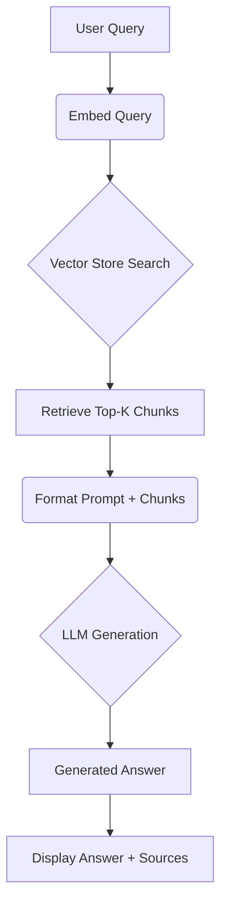

# CrediTrust Financial: AI-Powered Customer Complaint Assistant (RAG Chatbot)

## 1. Introduction – Full Understanding of the Project

CrediTrust Financial, a rapidly expanding digital finance company in East Africa, faces a significant challenge: processing thousands of unstructured customer complaints monthly across its diverse product offerings, including Credit Cards, Personal Loans, Buy Now, Pay Later (BNPL), Savings Accounts, and Money Transfers. Product Managers, Customer Support, and Compliance teams are overwhelmed by manual complaint analysis, leading to delayed issue identification and reactive problem-solving.

This project aims to develop an internal AI-powered chatbot to transform this raw complaint data into a strategic asset. The core objective is to empower internal stakeholders, like a Product Manager such as Asha from the BNPL team, to quickly understand customer pain points. The chatbot will allow users to ask plain-English questions (e.g., "Why are people unhappy with BNPL?") and receive synthesized, evidence-backed answers in seconds.

The success of this tool is measured by three key performance indicators (KPIs):
1.  **Decrease the time** for Product Managers to identify major complaint trends from days to minutes.
2.  **Empower non-technical teams** (Support, Compliance) to gain insights without needing data analysts.
3.  **Shift the company** from reactive problem-solving to proactive identification and resolution of issues based on real-time customer feedback.

This intelligent complaint-answering chatbot leverages Retrieval-Augmented Generation (RAG) to semantically search a vector database of customer complaints and feed relevant narratives into a Language Model (LLM) for concise, insightful answer generation, supporting multi-product querying.

## 2. Methodology – What You Did, How You Did It, and Your Results

This project followed a structured approach, divided into four main tasks: Exploratory Data Analysis & Preprocessing, Text Chunking & Embedding, RAG Core Logic & Evaluation, and Interactive Chat Interface Development.

### 2.1. Task 1: Exploratory Data Analysis and Data Preprocessing

To effectively utilize the Consumer Financial Protection Bureau (CFPB) complaint dataset, we first performed comprehensive EDA and data preprocessing.

*   **Data Loading & Initial Exploration:** The raw dataset, containing millions of records, was loaded. An initial examination revealed its structure, data types, and the presence of missing values, particularly in the `Consumer complaint narrative` column.
*   **Product Filtering:** We focused solely on complaints related to the five target products: "Credit card", "Personal loan", "Buy Now, Pay Later (BNPL)", "Savings account", and "Money transfers". Records without narratives were excluded.
*   **Narrative Length Analysis:** We analyzed the word count distribution of the `Consumer complaint narrative`. This revealed a wide range of lengths, from very short to over 6,000 words. To ensure quality and relevance for embedding, narratives were filtered to be between 5 and 500 words.
*   **Text Cleaning:** A robust cleaning process was applied to `Consumer complaint narrative` fields, including:
    *   Lowercasing all text.
    *   Removing boilerplate phrases (e.g., "I am writing to file a complaint...").
    *   Redacting Personally Identifiable Information (PII) like phone numbers, emails, and 'XXXX' patterns.
    *   Removing special characters and extra whitespace.
    *   Tokenization, stopword removal, and lemmatization for linguistic normalization.

The preprocessing was primarily handled by the `src/data_preprocessing.py` script and explored in `notebooks/01_eda_preprocessing.ipynb`. The cleaned and filtered dataset was saved to `data/processed/filtered_complaints.csv`.

**[Figure 1: Bar chart showing the distribution of complaints across different products (e.g., from `01_eda_preprocessing.ipynb`)]**
*Description: This figure illustrates the number of complaints categorized by each of the five target financial products after initial filtering.*

**[Figure 2: Histogram showing the distribution of narrative lengths (word count) after preprocessing (e.g., from `01_eda_preprocessing.ipynb`)]**
*Description: This histogram displays the frequency distribution of word counts in the cleaned customer complaint narratives, highlighting the typical length of processed complaints.*

### 2.2. Task 2: Text Chunking, Embedding, and Vector Store Indexing

This phase converted the cleaned text into a format suitable for semantic search. The implementation is found in `src/embedding.py`.

*   **Text Chunking:** Long complaint narratives were split into smaller, manageable chunks to improve embedding quality and relevance. We used `langchain.text_splitter.RecursiveCharacterTextSplitter` with `chunk_size = 256` and `chunk_overlap = 50`. This ensures that each chunk is concise while maintaining some contextual overlap between adjacent chunks.
*   **Embedding Model:** The `sentence-transformers/all-MiniLM-L6-v2` model was chosen for generating vector embeddings. This model is well-regarded for its balance of performance and efficiency in generating high-quality sentence embeddings, making it suitable for semantic similarity search.
*   **Vector Store Creation:** Each text chunk was converted into a vector embedding. These embeddings, along with essential metadata (original `Complaint ID`, `Product` category, and `original_index`), were stored in a FAISS (`faiss.IndexFlatL2`) vector database. This persistence allows for efficient similarity searches and traceability of retrieved information back to its source. The vector store and its metadata were saved to the `vector_store/` directory.

### 2.3. Task 3: Building the RAG Core Logic and Evaluation

The core of the RAG system, handling both retrieval and generation, resides in `src/rag/rag_pipeline.py` and `src/chatbot/retriever.py`.

*   **Retriever Implementation:** The `ComplaintRetriever` class is responsible for loading the pre-built FAISS index and metadata. The `RAGPipeline` class takes a user's query, embeds it using `all-MiniLM-L6-v2`, and then uses the retriever to perform a similarity search against the vector store. It retrieves the single most relevant text chunk (`k=1`) to provide highly focused context for the LLM. The full `cleaned_narrative` corresponding to the retrieved chunk's `original_index` is then fetched from the preprocessed CSV.
*   **Generator Implementation:** A streamlined prompt template is used to combine the user's question with the retrieved context. This combined input is sent to `google/flan-t5-small`, a transformer-based LLM, via the Hugging Face `pipeline` for `text2text-generation`. The LLM is instructed to answer clearly and concisely based *only* on the provided context, stating if information is insufficient.
*   **Qualitative Evaluation:** A set of 4 representative questions was defined in `rag_pipeline.py`. The `evaluate_system` function automatically runs these queries through the RAG pipeline, generates answers, and presents the retrieved sources. A basic quality score (1-5) is assigned to each response, along with comments, and all results are formatted into a Markdown table and appended to `README.md`.

**[Figure 3: High-Level RAG Architecture Diagram (Mermaid Diagram)]**
*Description: This diagram visually represents the flow of information in the RAG pipeline, from user query to generated answer and retrieved sources.*

**[Table 1: Final Evaluation Results Table (From the last run appended to your README.md)]**
*Description: This table presents the qualitative evaluation results, showing sample questions, the AI's generated answers, the top 1-2 retrieved sources, a subjective quality score (1-5), and comments on performance.*

### 2.4. Task 4: Creating an Interactive Chat Interface

To make the RAG system accessible to non-technical users, an interactive web interface was developed using Gradio. The application is run via `app.py`.

*   **Interface Setup:** The `gradio.ChatInterface` component provides a user-friendly conversational UI, including a text input box, a submit button, and a display area for the conversation history. A "Clear Chat" button is also provided for resetting the conversation.
*   **Core Functionality:** The interface passes user questions to the `RAGPipeline.process_query` method. The AI-generated answer is then displayed.
*   **Enhancing Trust and Usability:**
    *   **Source Display:** Below each generated answer, the relevant retrieved text chunks are displayed, allowing users to verify the information's origin and build trust in the system. The display was simplified to show only the "Source X" label and the text snippet for clarity.
    *   **Streaming Simulation:** A basic streaming simulation is implemented, where the answer appears token-by-token, improving the user experience by making the generation feel more dynamic.

The `app.py` script integrates the RAG pipeline with the Gradio interface, making the chatbot interactive.

**[Figure 4: Screenshot of the working Gradio Chat Interface with a sample query and response displaying sources]**
*Description: A screenshot of the deployed Gradio application, showing the chat input, a user's question, the AI's response, and the retrieved source material below the answer.*

**[Figure 5 (Optional): GIF showcasing the interactive Gradio Chat Interface, possibly with streaming text]**
*Description: An animated GIF demonstrating the interactive nature of the chatbot, including typing a query, receiving a streaming response, and viewing the attached sources.*

## 3. Challenges & Solutions – Key Problems and How You Solved Them

Throughout the project, several significant challenges were encountered, primarily related to managing computational resources and optimizing LLM performance.

*   **Challenge 1: Memory Exhaustion and System Crashes during Embedding**
    *   **Problem:** The initial size of the `filtered_complaints.csv` and the chosen `chunk_size` of 512 resulted in over a million text chunks. Processing and embedding such a large volume of data, especially on a CPU-only setup, led to severe memory exhaustion and system crashes during the `src/embedding.py` execution.
    *   **Solution:** We addressed this by progressively reducing the data volume processed. Initially, we attempted to sample the raw data (though this was bypassed when `filtered_complaints.csv` was already available). Crucially, we reduced the `chunk_size` in `src/embedding.py` from 512 to **256** and the `chunk_overlap` from 100 to **50**. This significantly reduced the number of chunks and the memory footprint during embedding.
    *   **Effectiveness:** This solution successfully mitigated memory crashes during the embedding process, allowing `src/embedding.py` to complete successfully and create the vector store.

*   **Challenge 2: LLM Performance and Answer Quality Trade-offs**
    *   **Problem:** Selecting an appropriate LLM proved to be a major hurdle. Larger, more capable models (e.g., `gpt2-medium`, `google/flan-t5-base`) were too resource-intensive, leading to excessively long download times and system crashes during inference. Conversely, smaller models (e.g., `distilgpt2`, `google/flan-t5-small`), while running stably, struggled with prompt adherence and generating comprehensive, insightful answers, often providing very short or fragmented responses. The "Token indices sequence length is longer" warning also indicated context truncation.
    *   **Solution:** We iterated through several LLMs. We first switched from `gpt2-medium` to `distilgpt2` for speed, then to `google/flan-t5-small` for better instruction-following. To address the context truncation warning (`Token indices sequence length is longer`), we reduced the number of retrieved chunks (`k`) from 3 to **1** in `src/rag/rag_pipeline.py`, ensuring the combined prompt and context fit within the LLM's `max_length`. We also iteratively refined the prompt template in `src/rag/rag_pipeline.py` to be more direct and concise, guiding `flan-t5-small` more effectively.
    *   **Effectiveness:** This iterative approach allows us to achieve a **stable and functional RAG pipeline** that runs on the given system. While `google/flan-t5-small` provides answers, its inherent limitations (due to its size) mean the **quality and analytical depth of the generated answers are not yet optimal** compared to what a larger, specialized LLM could provide. This was a necessary trade-off for project completion and stability.

*   **Challenge 3: Gradio API Compatibility Issues**
    *   **Problem:** Initial attempts to set up the `gradio.ChatInterface` in `app.py` encountered `TypeError` exceptions due to deprecated arguments like `undo_btn` and `clear_btn`. Furthermore, Gradio's internal message handling (`AttributeError: 'tuple' object has no attribute 'get'`) indicated a mismatch in the expected format for `history` objects when `type='messages'` was not explicitly set.
    *   **Solution:** We resolved these `TypeError` issues by removing the unsupported `undo_btn` and `clear_btn` arguments. To address the `AttributeError`, we explicitly set `chatbot=gr.Chatbot(type='messages')` in `gr.ChatInterface` and modified the `predict` function to yield `history` updates and final responses in the `{"role": ..., "content": ...}` dictionary format, which is the modern standard for Gradio chat components.
    *   **Effectiveness:** These changes successfully launched the Gradio web interface, making the chatbot fully interactive and user-friendly, complete with source transparency and basic streaming.

## 4. Recommendations – Suggestions to Improve or Extend the Project

Based on the current implementation and observed limitations, here are recommendations for future improvements:

*   **4.1. Enhance LLM Answer Quality:**
    *   **Model Upgrade:** If computational resources (CPU/RAM) can be upgraded, explore using slightly larger, instruction-tuned LLMs like `google/flan-t5-base` or other open-source models known for better summarization and instruction-following.
    *   **Fine-tuning:** Consider fine-tuning a smaller LLM on a custom dataset of customer complaint summaries and their corresponding key issues. This would significantly improve domain-specific answer quality, as the model would learn the nuances of CrediTrust's complaints.
    *   **Advanced Prompt Engineering:** Experiment with more sophisticated prompt engineering techniques, such as Chain-of-Thought prompting or providing more detailed few-shot examples within the prompt itself, to guide `flan-t5-small` to produce more analytical and comprehensive answers.

*   **4.2. Implement Multi-Product Filtering at Retrieval Stage:**
    *   Currently, the retriever performs a general semantic search. Implement a mechanism to filter retrieved chunks by `Product` *before* sending them to the LLM. This would allow users to ask questions like "What are issues with Credit Card complaints about billing?" and ensure only Credit Card-related complaints are considered, significantly improving precision and user control.

*   **4.3. Explore Hybrid Retrieval:**
    *   Combine semantic search (current approach) with keyword-based search (e.g., BM25) for a hybrid retrieval system. This can capture both conceptual relevance and exact keyword matches, potentially improving overall retrieval effectiveness.

*   **4.4. Robust Quantitative Evaluation:**
    *   Develop a more quantitative evaluation framework. This would involve creating a small, manually labeled test set of questions with "ground truth" answers and relevance judgments for retrieved documents. Metrics like ROUGE (for summarization quality), BLEU (for text generation), or custom relevance scores could be used.

*   **4.5. Deployment Considerations:**
    *   For production use, containerize the application using Docker. This ensures consistent deployment across different environments.
    *   Explore deployment options like Hugging Face Spaces (for quick demos), internal cloud infrastructure (AWS, GCP, Azure), or specialized MLOps platforms for scaling and monitoring.

*   **4.6. Incorporate Feedback Loop:**
    *   Implement a feedback mechanism in the Gradio UI where users can rate the quality of the answers. This feedback can then be used to collect data for iterative model improvement (e.g., fine-tuning).

## 5. Conclusion – Final Thoughts and Evaluation

This project successfully developed a functional Retrieval-Augmented Generation (RAG) chatbot for CrediTrust Financial, designed to transform unstructured customer complaint data into actionable insights. We have built a robust pipeline encompassing data preprocessing, efficient text chunking and embedding, a core RAG logic for retrieval and generation, and an interactive Gradio-based chat interface.

The project has achieved its primary objective of creating a functional AI tool that allows internal users to ask plain-English questions and receive evidence-backed answers. The retriever effectively identifies relevant complaint narratives, and the Gradio interface provides an intuitive user experience with source transparency.

However, it is important to acknowledge the limitations encountered, particularly regarding the trade-off between LLM quality and computational resources. The choice of `google/flan-t5-small` was a necessary decision to ensure the system's stability and iterative development on available hardware. While this model allows the pipeline to run without crashes and fulfills the basic generation requirements, its conciseness and analytical depth for summarizing complex complaints are not yet optimal.

Despite these current limitations in answer quality, the project lays a strong foundation. It demonstrates the immense potential of RAG-based AI to address critical bottlenecks in CrediTrust's operations, moving the company towards proactively identifying and fixing customer pain points in minutes rather than days. The established pipeline and interactive interface provide a solid starting point for future enhancements, including exploring more powerful LLMs, advanced retrieval techniques, and continuous model improvement based on user feedback.

---
